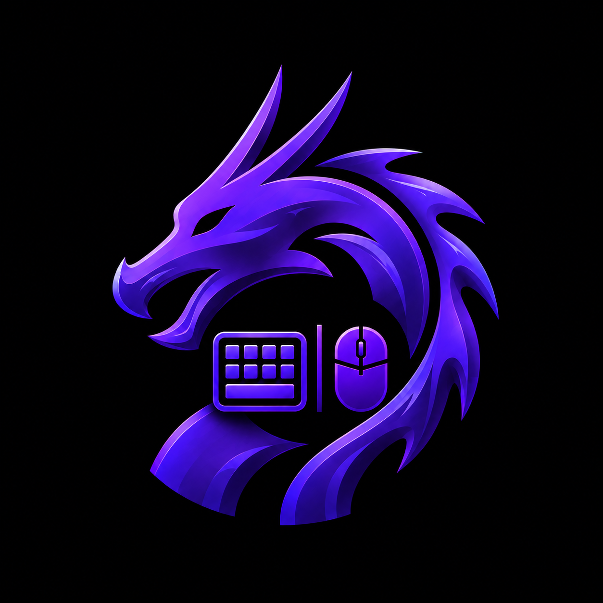
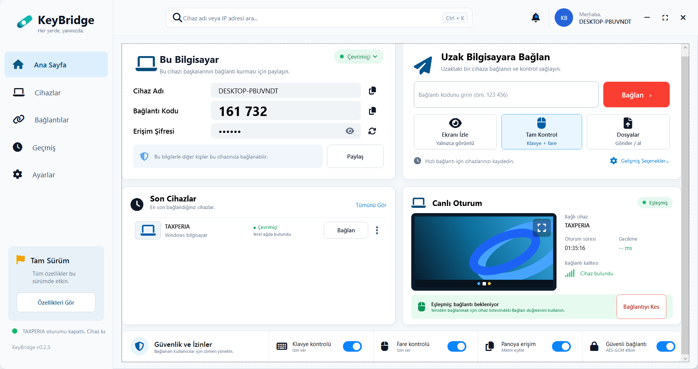

<p align="center"></p>

# KeyBridge

**A local-network desktop companion for two Windows PCs.** View the other screen, send keyboard and mouse input, and transfer files after the person at that PC approves the connection.

Windows 10/11 · .NET 8 · WPF · LAN only · Source-available, noncommercial license

> [!IMPORTANT]
> **KeyBridge is not an AnyDesk or TeamViewer replacement.** It does not provide an internet relay, a cloud account, cross-network connections, unattended access, or a public device-ID service. Both Windows PCs must be running KeyBridge on the same trusted local network, and the receiving PC must approve each new session. The live screen and control features work *within that scope*.



*KeyBridge 0.2.5 on Windows. The interface is currently in Turkish; the six-digit code in this example is time-limited.*

## At a glance

| What KeyBridge does | What it does not do |
| --- | --- |
| Finds nearby KeyBridge devices on a LAN | Find a PC anywhere on the internet |
| Pairs with a six-digit code and an approval prompt | Connect silently or without consent |
| Reconnects a saved device with a fresh approval, without re-entering the code | Use a hosted relay or NAT traversal service |
| Streams the primary display and forwards permitted keyboard/mouse input | Control a locked screen, UAC prompt, or every elevated app |
| Sends files to the other PC's `Downloads\KeyBridge Transfers` folder | Browse or manage the other PC's whole file system |

KeyBridge is intended for **your own or explicitly authorized Windows computers on a trusted LAN**. It is not designed for remote IT support across the internet.

## Features

- LAN discovery and code-based first pairing, with an approval dialog on the receiving PC.
- Saved-device reconnects: choose **Connect** and approve on the other PC; no new code is needed unless the device identity changes.
- Primary-display viewing, a full-screen viewer, and optional keyboard/mouse control.
- `Ctrl + Alt + K` to return keyboard control to the local PC.
- Opt-in text-only clipboard synchronization.
- Authenticated, encrypted file sending, up to **100 MB per file**, with a local file picker and transfer queue. Received files are saved to `Downloads\KeyBridge Transfers`.
- Session disconnect without forgetting the paired device; a separate **Forget device** action removes the saved pairing.

## Requirements

- Two Windows 10 (version 1809 or later) or Windows 11 x64 PCs on the **same local network**.
- KeyBridge running on **both** PCs, preferably the same version.
- The receiving PC available to approve the connection.
- Windows Firewall permission for KeyBridge on the **Private** network profile.

The self-contained portable build does not require a separate .NET installation. Building from source requires the [.NET 8 SDK](https://dotnet.microsoft.com/download/dotnet/8.0).

## Get started

1. Run `KeyBridge.exe` on both computers. Complete the first-run setup and choose which input and clipboard permissions to allow.
2. On the PC you want to **control**, read its six-digit connection code.
3. On the controlling PC, select that device and click **Pair** (`Eşleştir`), enter the code in **Connect to a remote computer** (`Uzak Bilgisayara Bağlan`), then click **Connect** (`Bağlan`).
4. On the receiving PC, approve the connection request. The controlling PC can then choose **View screen** (`Ekranı İzle`) or **Full control** (`Tam Kontrol`).
5. For a later session, use **Recent devices → Connect** (`Son Cihazlar → Bağlan`) and approve the new request on the receiving PC. You should not need another code.
6. Use `Ctrl + Alt + K` to stop forwarding keyboard input. **Disconnect** ends the session but keeps the pairing; **Forget device** removes the pairing.

The on-screen interface is currently in Turkish. The English labels above are descriptions, with the actual Turkish labels in parentheses.

### If a connection does not start

- Check that **both** PCs show the expected KeyBridge version and are on the same trusted LAN.
- If a previous code attempt failed, generate a **new code** on the receiving PC; a successful approval may consume the old one.
- Allow KeyBridge through Windows Firewall on the **Private** profile. For a portable build, run `setup-private-network.ps1` from the published application folder in an **Administrator PowerShell** on both PCs. It limits inbound access to the KeyBridge executable and local subnet; run it again if the EXE moves.
- If the receiver approves but the controller remains at “Waiting for connection,” report the exact status shown on **both** PCs, their versions, and whether the device appears in **Recent devices**. Do not post codes or pairing tokens in a public issue.

Do **not** forward KeyBridge ports from your router to the public internet.

## Network and security model

KeyBridge uses UDP broadcasts/multicast for LAN discovery and a short code plus a visible approval dialog for initial pairing. Saved-device reconnect requests are authenticated with the pairing token and still require approval. Subsequent screen, input, file, and clipboard payloads use AES-GCM protection derived from that token.

This is **not a security audit or a guarantee of safety on an untrusted network**. Discovery and initial pairing traffic—including the short code and the token used for later encryption—is not protected against a person who can monitor that LAN. AES-GCM on later payloads does not fix that initial trust gap. Pairing material is also saved locally in the user's KeyBridge settings; keep that file private and never paste it into issues or logs. Use KeyBridge only on networks and computers you trust. See [SECURITY.md](SECURITY.md) for reporting and supported-version information.

| Service | Port |
| --- | --- |
| Discovery | UDP `48740` |
| Pairing | TCP/UDP `48741` |
| Keyboard and mouse | TCP/UDP `48742` |
| Screen viewing | TCP `48743` |
| File transfer | TCP `48744` |
| Text clipboard | TCP `48745` |

## Build from source

```powershell
git clone https://github.com/Taxperia/keyboard.git
cd keyboard
dotnet restore .\KeyBridge.sln
dotnet build .\KeyBridge.sln -c Release
dotnet run --project .\KeyBridge\KeyBridge.csproj
```

Build a self-contained Windows x64 portable package:

```powershell
.\scripts\publish-release.ps1
```

The output is `artifacts\publish\KeyBridge-win-x64\KeyBridge.exe`. For a smaller package that requires the .NET Desktop Runtime, use `-Mode framework-dependent`. If Inno Setup is installed, `.\scripts\make-installer.ps1` builds an installer.

## Current limitations

- Windows only; macOS and Linux are not supported.
- Same-LAN use only. There is no cloud relay, account system, internet rendezvous, or unattended mode.
- Only the primary display is streamed; multiple-monitor selection is not implemented.
- Clipboard synchronization is text-only. The file window sends selected local files to a fixed receiving folder; it is **not** a remote file browser.
- Windows integrity boundaries still apply: an unelevated KeyBridge process may not control elevated windows or secure desktops.
- The application has not undergone a formal independent security audit.

## Contributing and support

Bug reports and feature requests are welcome through [GitHub Issues](https://github.com/Taxperia/keyboard/issues). Please read [CONTRIBUTING.md](CONTRIBUTING.md) and the [Code of Conduct](CODE_OF_CONDUCT.md) first. For security vulnerabilities, **do not open a public issue**; follow [SECURITY.md](SECURITY.md).

See the [changelog](CHANGELOG.md), [release notes](RELEASE_NOTES.md), and the [feature/security roadmap (Turkish)](OZELLIK_VE_GUVENLIK_YOL_HARITASI.md).

## License and attribution

KeyBridge is **source-available, not open-source under an OSI-approved license**. It is distributed under the [PolyForm Noncommercial License 1.0.0](LICENSE); commercial use is not permitted without separate permission from the copyright holder. Read the license before using, modifying, or distributing it. Third-party font attribution is in [NOTICE](NOTICE).

Copyright 2026 Taxperia.
